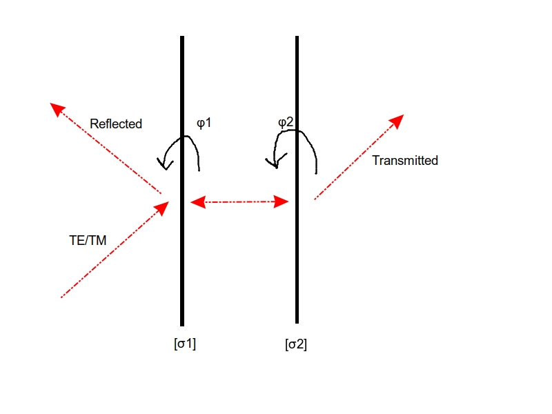

Assume we have two infinite surfaces like in the following schematic with surface conductivities $\sigma_1$ and $\sigma_2$. The conduvtivities are  tensors with both real and imaginary part. They can have the general form
$$
\begin{pmatrix}
Re(\sigma_x)+ i Im(\sigma_x) & 0\\
0 & Re(\sigma_y)+ i Im(\sigma_y)
\end{pmatrix}
$$
The surfaces are separated by a distance $L$ and we illuminate the
system with a plane wave from the left that is in oblique incidence
with respect to the surfaces. We want to maximize the absorption of
the system. The formula for Absorption is 

$$A = \mathbf{k^{+}} \cdot \langle \mathbf{\vec{S}} \rangle_{\mathbf{\text{inc}}} - \mathbf{k^{+}} \cdot \langle \mathbf{\vec{S}} \rangle_{\mathbf{\text{refl}}} - \mathbf{k^{-}} \cdot \langle \mathbf{\vec{S}} \rangle_{\mathbf{\text{trans}}}
$$
where $\mathbf{k^{+}}$ and $\mathbf{k^{-}}$ are the wave vectors of the forward and backward waves, respectively, and $\langle \mathbf{\vec{S}} \rangle_{\mathbf{\text{inc}}}$, $\langle \mathbf{\vec{S}} \rangle_{\mathbf{\text{refl}}}$, and $\langle \mathbf{\vec{S}} \rangle_{\mathbf{\text{trans}}}$ are the time-averaged Poynting vectors of the incident, reflected, and transmitted waves, respectively. The absorption is the power absorbed per unit area of the surface.
We will also integrate across the polarizations and the oblque angles of incidence. The absorption is given by the following formula:
$$
\int_{0}^{\frac{\pi}{2}} \int_{0}^{\frac{\pi}{2}} A(\theta, \phi) \cos(\theta) \, d\theta \, d\phi
$$

Where the $φ$ and $θ$ are the angles of incidence and polarization, respectively. The incident electric field is given by:

$$
\mathbf{E}_{\text{inc}}(x,z, \phi, \theta) = E_0 \left( \cos\phi \cdot \hat{y} + \sin\phi \left( \cos\theta \, \hat{x} + \sin\theta \, \hat{z} \right) \right) e^{-i k_0 (x \sin(\theta) + z \cos(\theta))}
$$
After computations the absorption is given by the following formula:

$$
\mathcal{A} = \frac{15}{22 π} \cos(\theta)\left( 3 - 4\left(\left| R_y \right|^2 +\left| T_y \right|^2\right) +\cos(4\theta)- 4\left( \left| R_x \right|^2 + \left| T_x \right|^2 \right) \sec^2(\theta) +2\cos(2\phi)\sin^{2}(2\theta)\right)
$$

We will do brute force optimization to find the maximum absorption and present for which $φ_1$,$φ_2$ the maximum is achieved in order to research if we have twistronics.
The code is in jax and is highly optimized,also it can run automatically on parallel 
gpu's and tpu's with modifying only one 3 lines of code.
Also it is done in a batched manner because the grid is multidimensional and it can't fit in the memory of a single gpu or tpu.